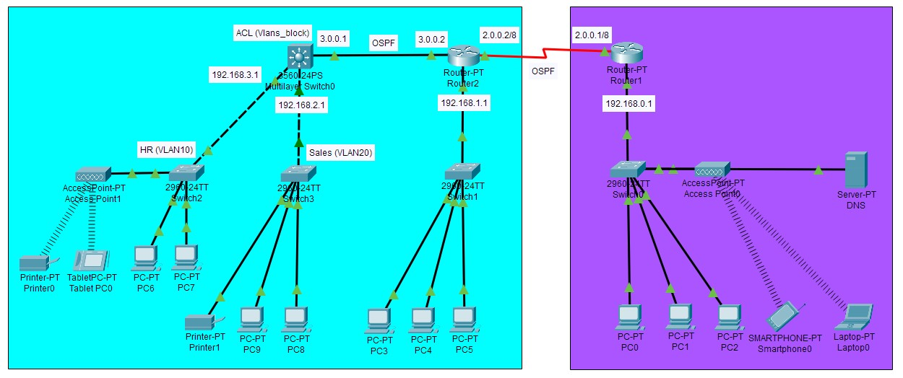
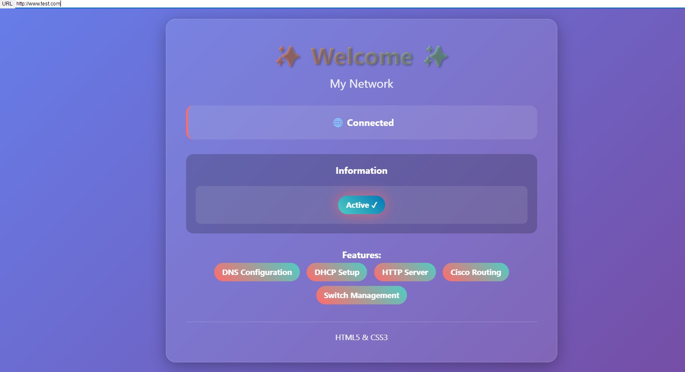
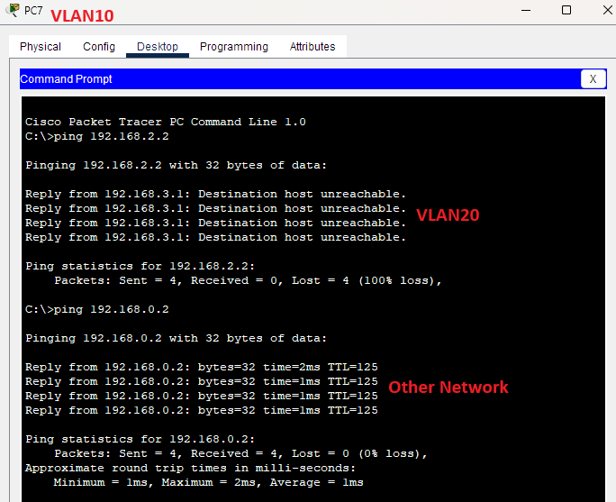

# Enterprise Network Simulation (Cisco Packet Tracer)

This project demonstrates the design and configuration of a **small-scale enterprise network** using Cisco Packet Tracer.  
It applies multiple **CCNA-level concepts** including routing, VLANs, inter-VLAN communication, ACLs, DNS services, port security, and more.

---

## 🖥️ Network Topology


The topology simulates a typical enterprise environment with multiple departments, a core router, distribution/access switches, and servers.

---

## 🚀 Key Features & Technologies
- **Dynamic Routing (OSPF)**
  - Configured OSPF for dynamic and scalable routing between network segments.
  - Used loopback interfaces for router ID and ensured proper neighbor relationships.

- **VLAN Segmentation**
  - Created VLANs for different departments (HR, Sales).
  - Configured trunking between switches.
  - Assigned access ports for end devices.

- **Inter-VLAN Routing**
  - Implemented Layer 3 Switch for communication between VLANs.

- **Access Control Lists (ACLs)**
  - Applied standard/extended ACLs to control access between VLANs and to/from the server network.
  - Example: Restrict HR VLAN from accessing Sales.

- **DNS Server**
  - Configured a DNS server to resolve hostnames to IP addresses inside the enterprise network.

- **Port Security**
  - Applied port security on access switch ports to prevent unauthorized device connections.
  - Restricted the number of MAC addresses and enabled violation modes.

- **DHCP**
  - Configured DHCP to automate IP address assignment for client devices.

---

## ⚙️ How to Run the Project
1. Install [Cisco Packet Tracer](https://www.netacad.com/courses/packet-tracer).
2. Download this repository or clone it:
   ```bash
   git clone https://github.com/Mhamaadd/enterprise-network-simulation
---

## ✅ Verification & Testing

- **DNS Resolution Test**  
  A client inside the network types a domain name in the browser (e.g., `www.test.com`) and the DNS server resolves it to the correct IP.  
  

- **Connectivity Checks**  
  - Verify OSPF neighbor adjacency with `show ip ospf neighbor`  
  - Ping between VLANs (according to ACL rules)
  
